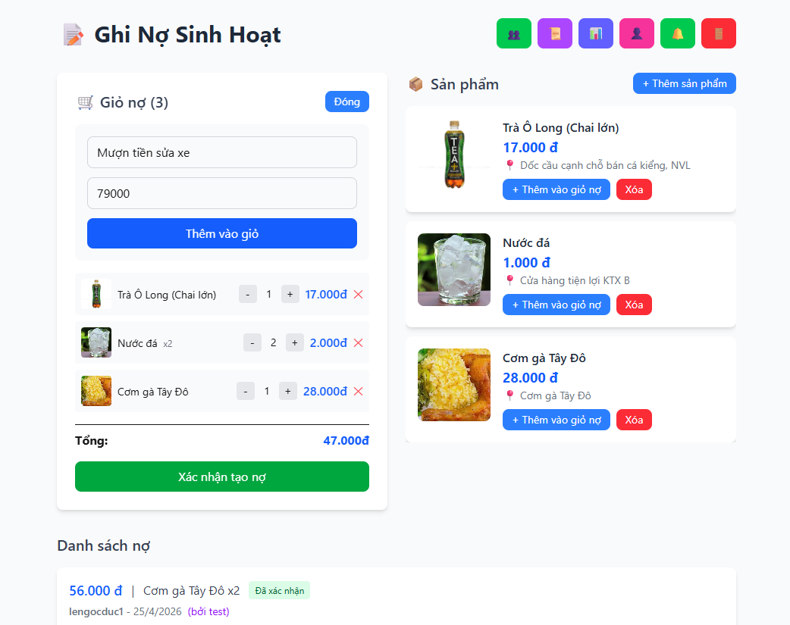

# Debt Tracker - Quản lý Nợ



Ứng dụng quản lý nợ cho nhóm bạn, giúp theo dõi các khoản nợ giữa các thành viên một cách dễ dàng.

## Tính năng

### 🔐 Authentication
- **Đăng ký tài khoản**: Tạo tài khoản với username và password
- **Đăng nhập**: Đăng nhập với username/password
- **Đăng xuất**: Xóa session và logout
- **Profile**: Chỉnh sửa thông tin cá nhân (số điện thoại, avatar, đổi mật khẩu)

### � Quản lý Bạn Bè
- **Thêm bạn bè**: Tìm kiếm và gửi lời mời kết bạn
- **Chấp nhận lời mời**: Xem và chấp nhận lời mời kết bạn
- **Danh sách bạn bè**: Xem danh sách bạn bè đã kết bạn
- **Xóa bạn bè**: Xóa bạn bè (lịch sử nợ vẫn được giữ lại)
- **Tìm kiếm**: Tìm kiếm người dùng để kết bạn

### 📦 Quản lý Sản Phẩm
- **Thêm sản phẩm**: Tạo sản phẩm/dịch vụ với:
  - Tên sản phẩm
  - Giá tiền
  - Ảnh sản phẩm (upload từ máy)
  - Chỗ mua
- **Danh sách sản phẩm**: Xem sản phẩm từ bạn bè (chỉ share giữa người đã kết bạn)
- **Xóa sản phẩm**: Xóa sản phẩm do chính mình tạo

### 🛒 Giỏ Nợ
- **Thêm vào giỏ**: Thêm sản phẩm vào giỏ nợ
- **Nhập thủ công**: Nhập khoản nợ thủ công vào giỏ
- **Quản lý số lượng**: Tăng/giảm số lượng sản phẩm trong giỏ
- **Chia đều**: Tự động chia đều tổng tiền cho người được chọn
- **Multi-select**: Chọn nhiều người nợ cùng lúc

### 💰 Quản lý Nợ
- **Tạo nợ từ giỏ**: Tạo nợ từ các sản phẩm trong giỏ
- **Danh sách nợ**: Xem tất cả các khoản nợ với phân trang (3 items/trang)
- **Trạng thái nợ**:
  - `Chờ xác nhận` - Khoản nợ mới được tạo
  - `Đã xác nhận` - Người nợ đã xác nhận khoản nợ
  - `Đã từ chối` - Người nợ đã từ chối khoản nợ
  - `Đã thanh toán` - Khoản nợ đã được thanh toán
- **Xác nhận/Từ chối**: Người được gán nợ có thể xác nhận hoặc từ chối khoản nợ
- **Thanh toán**: Đánh dấu khoản nợ đã thanh toán (soft delete)

### � Lịch Sử
- **Xem lịch sử**: Xem tất cả khoản nợ đã tạo
- **Tìm kiếm**: Tìm kiếm theo tên, nội dung, trạng thái
- **Phân trang**: Hiển thị 10 items/trang
- **Chi tiết**: Xem ngày tạo, ngày thanh toán, trạng thái

### 📊 Thống Kê
- **Tổng quan**: Tổng số tiền, chờ xác nhận, đã xác nhận, đã từ chối, đã thanh toán
- **Theo người nợ**: Biểu đồ số tiền nợ theo từng người
- **Theo trạng thái**: Phân tích theo từng trạng thái
- **Xu hướng theo tháng**: Biểu đồ xu hướng nợ theo thời gian

### 🔔 Thông Báo Realtime
- **Khoản nợ mới**: Thông báo khi có khoản nợ mới được gán
- **Xác nhận nợ**: Thông báo khi người nợ xác nhận/từ chối
- **Thanh toán**: Thông báo khi khoản nợ được đánh dấu thanh toán
- **Lời mời kết bạn**: Thông báo khi có lời mời kết bạn mới
- **Chấp nhận kết bạn**: Thông báo khi lời mời kết bạn được chấp nhận

### 🎨 Giao Diện
- **Modern UI**: Giao diện hiện đại với SweetAlert2
- **Modal**: Dialog với hiệu ứng blur
- **Avatar**: Hiển thị avatar người dùng
- **Responsive**: Tương thích với mọi thiết bị
- **Sticky cart**: Giỏ nợ luôn hiển thị khi cuộn
- **Loading indicator**: Hiển thị trạng thái tải dữ liệu

## Tech Stack

- **Frontend**: Next.js 16 (App Router), React, TypeScript
- **Styling**: Tailwind CSS
- **Database**: Supabase (PostgreSQL)
- **Storage**: Supabase Storage (cho ảnh sản phẩm và avatar)
- **Authentication**: Custom authentication (username/password) với localStorage
- **Realtime**: Supabase Realtime (cho thông báo realtime)
- **Alerts**: SweetAlert2
- **Icons**: Lucide React

## Cài đặt

1. Clone repository:
```bash
git clone https://github.com/ducdz1m2/debt-tracker.git
cd debt-tracker
```

2. Cài đặt dependencies:
```bash
npm install
```

3. Tạo file `.env.local` và thêm các biến môi trường:
```env
NEXT_PUBLIC_SUPABASE_URL=your_supabase_url
NEXT_PUBLIC_SUPABASE_PUBLISHABLE_KEY=your_supabase_key
```

4. Chạy development server:
```bash
npm run dev
```

5. Mở [http://localhost:3000](http://localhost:3000) trên trình duyệt

## Database Schema

### Users Table
```sql
CREATE TABLE users (
  id UUID PRIMARY KEY DEFAULT gen_random_uuid(),
  username TEXT UNIQUE NOT NULL,
  password_hash TEXT NOT NULL,
  phone TEXT,
  avatar_url TEXT,
  created_at TIMESTAMP WITH TIME ZONE DEFAULT NOW()
);
```

### Friends Table
```sql
CREATE TABLE friends (
  id UUID PRIMARY KEY DEFAULT gen_random_uuid(),
  user_id UUID NOT NULL REFERENCES users(id),
  friend_id UUID NOT NULL REFERENCES users(id),
  status TEXT DEFAULT 'pending',
  created_at TIMESTAMP WITH TIME ZONE DEFAULT NOW(),
  UNIQUE(user_id, friend_id)
);
```

### Products Table
```sql
CREATE TABLE products (
  id UUID PRIMARY KEY DEFAULT gen_random_uuid(),
  title TEXT NOT NULL,
  price DECIMAL(10,2) NOT NULL,
  image_url TEXT,
  purchase_location TEXT,
  created_by UUID NOT NULL REFERENCES users(id),
  created_at TIMESTAMP WITH TIME ZONE DEFAULT NOW()
);
```

### Debts Table
```sql
CREATE TABLE debts (
  id UUID PRIMARY KEY DEFAULT gen_random_uuid(),
  amount DECIMAL(10,2) NOT NULL,
  description TEXT NOT NULL,
  debt_date DATE NOT NULL,
  debtor_name TEXT NOT NULL,
  created_by TEXT,
  assigned_to UUID,
  status TEXT DEFAULT 'pending',
  deleted_at TIMESTAMP WITH TIME ZONE,
  created_at TIMESTAMP WITH TIME ZONE DEFAULT NOW()
);
```

## Deploy

Ứng dụng được deploy trên [Vercel](https://debt-tracker-jade.vercel.app/).

## License

MIT
